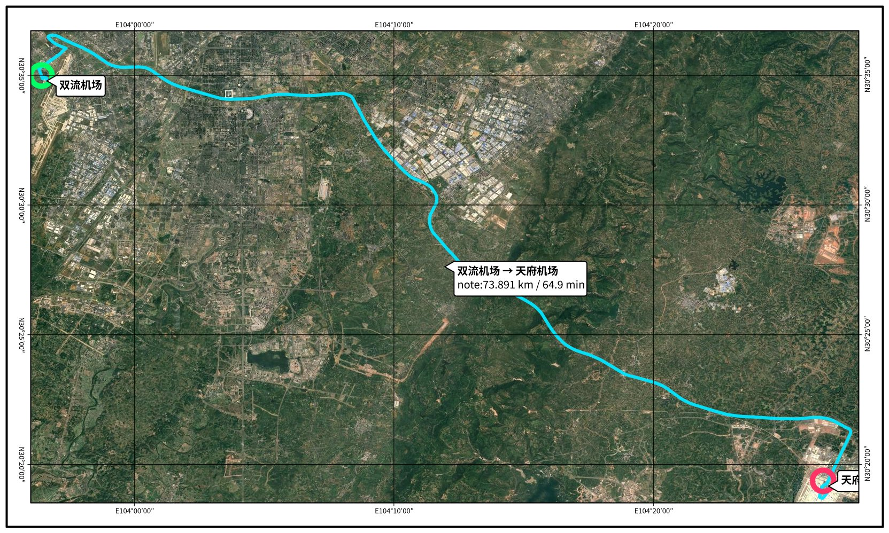
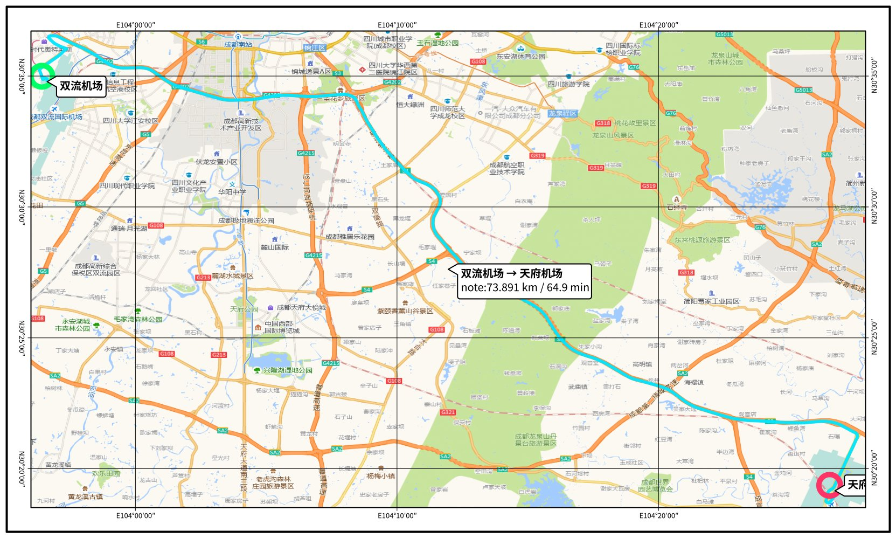

# earthg-route-bigimage

Cursor Agent Skill：调用 [map.earthg.cn](https://map.earthg.cn) **算路 (7023)** 与 **BigImage 出图 (8311)**，按地名或坐标生成路线大图（谷歌影像 / 高德电子底图可选）。

仓库地址：<https://github.com/CDJWD/earthg-route-bigimage>

## 服务

| 能力 | 地址 |
|------|------|
| 算路 | `https://map.earthg.cn:7023/api/route` |
| 大图 | `https://map.earthg.cn:8311/bigimage` |

坐标均为 **WGS84**（`lon,lat`）。

## 安装（Cursor）

1. Clone 本仓库，或下载 ZIP。
2. 将目录 `route-bigimage/` 复制到：
   - 项目内：`.cursor/skills/route-bigimage/`，或
   - 用户全局：`~/.cursor/skills/route-bigimage/`（Windows 多为 `%USERPROFILE%\.cursor\skills\route-bigimage\`）
3. （可选）若服务端开启了瓦片收费，再设置出图凭证：

```bash
# Windows PowerShell
$env:BIGIMAGE_TK = "你的地图TK"

# Linux / macOS
export BIGIMAGE_TK=你的地图TK
```

当前 EarthG 公开部署默认 **不收费、可不传 tk**。

4. 在 Cursor 中直接说，例如：「生成一张双流机场到天府机场的路线图」。

也可手动跑脚本：

```bash
cd route-bigimage
python scripts/route_to_bigimage.py --preset route --from 双流机场 --to 天府机场
python scripts/route_to_bigimage.py --preset electronic --from 双流机场 --to 天府机场
```

| `--preset` | 含义 |
|------------|------|
| `route` | 影像底图 + 叠路线，不加注记层 |
| `region` | 影像 + 高德注记（区域概况） |
| `electronic` | 高德电子地图底图（自带注记） |

## 示例图

双流机场 → 天府机场（约 73.9 km / 64.9 min）。

### 影像底图（`--preset route`）



### 高德电子底图（`--preset electronic`）



## 目录结构

```
.
├── README.md
├── LICENSE
├── examples/                         # 示例出图
│   ├── route_imagery_drawfix.jpg    # 影像底图
│   └── route_electronic_drawfix.jpg # 高德电子底图
└── route-bigimage/
    ├── SKILL.md
    ├── places.json
    └── scripts/route_to_bigimage.py
```

## 环境变量

| 变量 | 默认 | 说明 |
|------|------|------|
| `BIGIMAGE_TK` | （空，可选） | 仅当服务端开启「瓦片收费」时，bigimage GET 需要有效 tk；默认关闭则可不传 |
| `BIGIMAGE_HOST` | `https://map.earthg.cn:8311` | 出图服务 |
| `ROUTE_URL` | `https://map.earthg.cn:7023/api/route` | 算路服务 |

## 关于 EarthG

本 Skill 对接 **EarthG** 地图与算路服务（`map.earthg.cn`）。

- 组织 / 维护：[CDJWD](https://github.com/CDJWD)
- 服务站点：<https://map.earthg.cn>
- 问题反馈：请在本仓库 [Issues](https://github.com/CDJWD/earthg-route-bigimage/issues) 提交

© EarthG / CDJWD. 地图与算路能力由 EarthG 提供。
